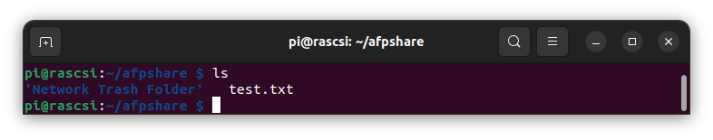
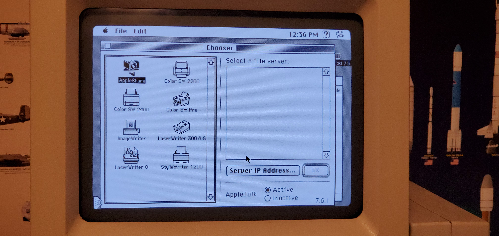
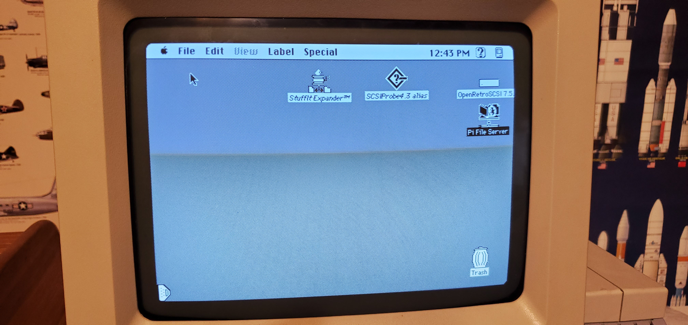

# Netatalk APF for linux install
###

From [RaSCSI AFP File Sharing](https://github.com/akuker/RASCSI/wiki/AFP-File-Sharing)

Also see Apple File Share section Mac Librian's excellent youtube [RaSCSI tutorial](https://www.youtube.com/watch?v=-qRG-0Pne-I&t=1020s)

    cd ~/RASCSI
    ./easyinstall.sh

Choose "8" to intall Netatalk

        .~~.   .~~.
      '. \ ' ' / .'
       .╔═══════╗.
      : ║|¯¯¯¯¯|║ :
     ~ (║|_____|║) ~
    ( : ║ .  __ ║ : )
     ~ .╚╦═════╦╝. ~
      (  ¯¯¯¯¯¯¯  ) RaSCSI Assistant
       '~ .~~~. ~'
           '~'

    Choose among the following options:
    INSTALL/UPDATE RASCSI (FULLSPEC version)
    1) install or update RaSCSI Service + Web Interface
    2) install or update RaSCSI Service
    3) install or update RaSCSI OLED Screen (requires hardware)
    CREATE HFS FORMATTED (MAC) IMAGE WITH LIDO DRIVERS
    ** For the Mac Plus, it's better to create an image through the Web Interface **
    4) 600MB drive (suggested size)
    5) custom drive size (up to 4000MB)
    NETWORK BRIDGE ASSISTANT
    6) configure network bridge for Ethernet (DHCP)
    7) configure network bridge for WiFi (static IP + NAT)
    INSTALL COMPANION APPS
    8) install AppleShare File Server (Netatalk)
    9) install Web Proxy Server (Macproxy)
    ADVANCED OPTIONS
    10) compile and install RaSCSI stand-alone
    11) configure the RaSCSI Web Interface stand-alone
    EXPERIMENTAL FEATURES
    12) install or update RaSCSI Control Board UI (requires hardware)
    Enter your choice (0-12) or CTRL-C to exit: 8

Edit /etc/netatalk/atalkd.conf and add rascsi_bridge to the end

    sudo nano /etc/netatalk/atalkd.conf

    # Format of lines in this file:
    #
    #    interface [ -seed ] [ -router | -dontroute ] 
    #       [ -phase { 1 | 2 } ] [ -addr net.node ]
    #       [ -net first[-last] ] [ -zone ZoneName ] ...
    #
    # -seed only works if you have multi-interfaces.  Any missing arguments are
    # automatically configured from the network.  Note: lines can't actually be
    # split, tho it's a good idea.
    #
    # -router is like -seed but it allows single-interface routing. -dontroute 
    # disables routing for the specified interface.
    #
    # Some examples:
    #
    #       The simplest case is no atalkd.conf.  This works on most platforms
    #       (notably not Solaris), since atalkd can discover the local interfaces
    #       on the machine.
    #
    #       Very slightly more complicated:
    #
    #               le0
    #       or
    #               eth0
    #
    #       for Solaris or Linux.
    #
    #       A much more complicated example:
    #
    #               le0 -phase 1
    #               le1 -seed -phase 2 -addr 66.6 -net 66-67 -zone "No Parking"
    #
    #       This turns on transition routing between the le0 and le1
    #       interfaces on a Sun.  It also causes atalkd to fail if other
    #       routers disagree about it's configuration of le1.
    #

    rascsi_bridge
   
Restart afpd service

    sudo systemctl restart afpd

A default afpshare folder has been created in your home directory

Go to Chooser in apple menu and open appleshare folder at 192.168.0.241

{:style="height:150px;width:300px"}{:style="height:150px;width:300px"}

{:style="height:150px;width:300px"}{:style="height:150px;width:300px"}

{:style="height:150px;width:300px"}{:style="height:150px;width:300px"}