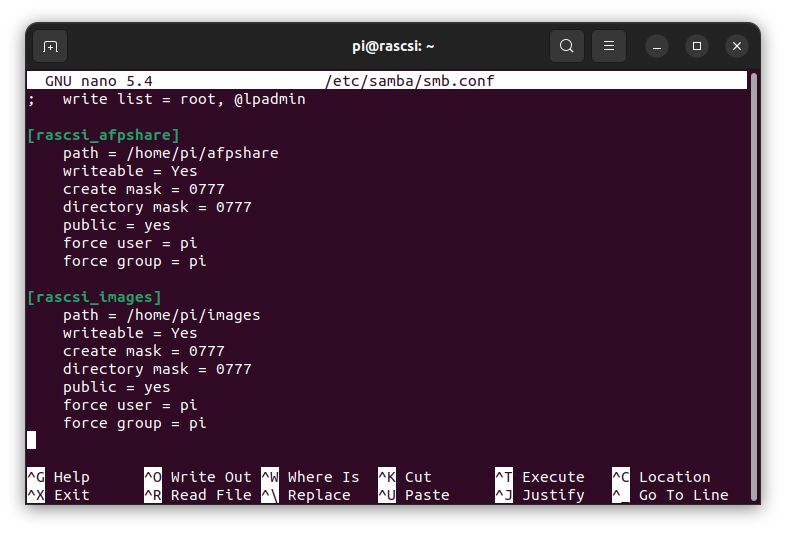
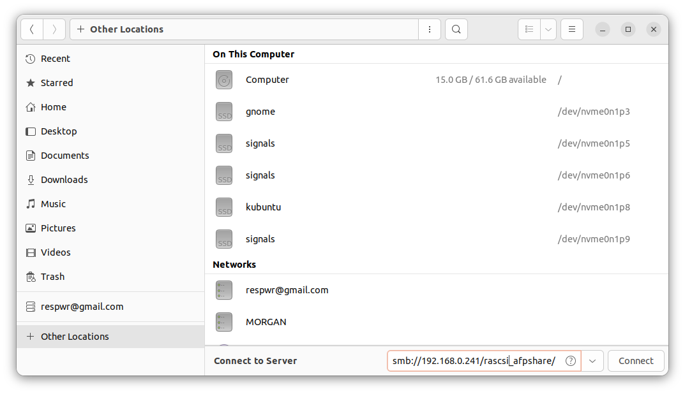
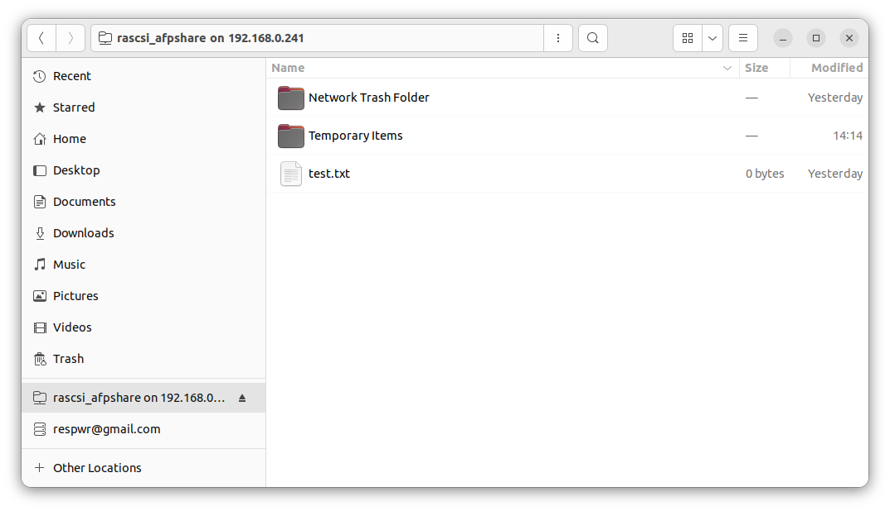

# Samba network file sharing for linux install
###

### Install libraries

    sudo apt install samba samba-common-bin

### Add desired share folders to smbd.conf file

    sudo nano /etc/samba/smdb.conf

### Restart samba

    sudo systemctl restart smdb

### From a linux computer file window, open "Other Locations"

