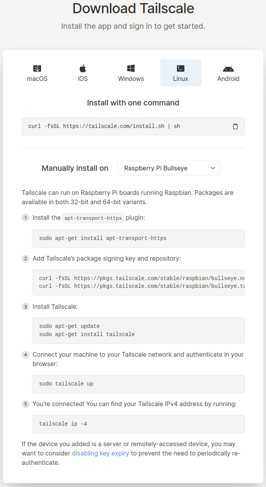
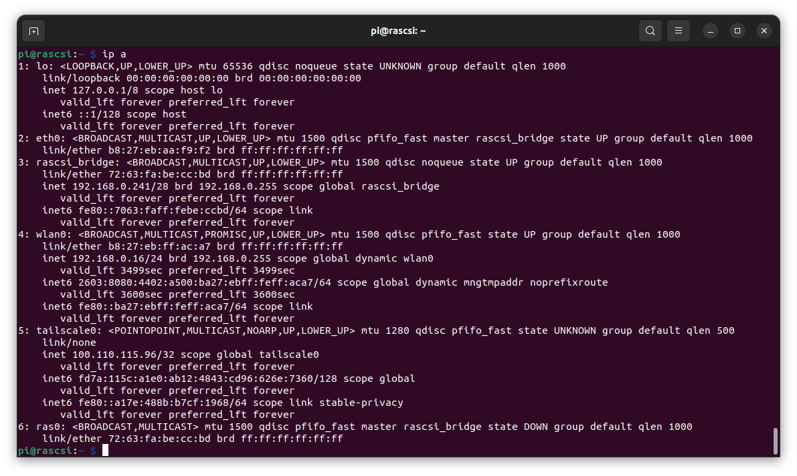
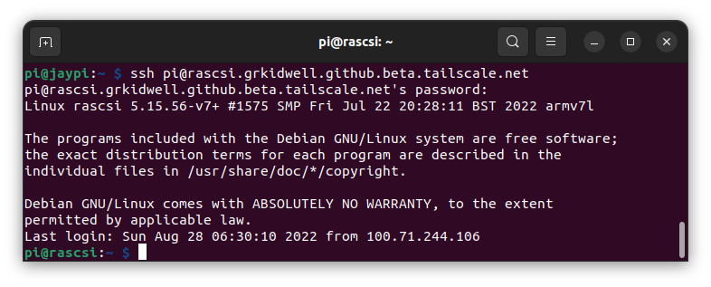
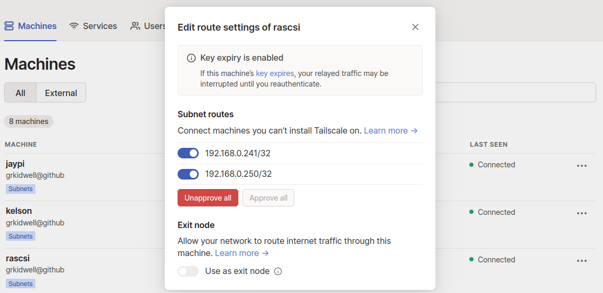
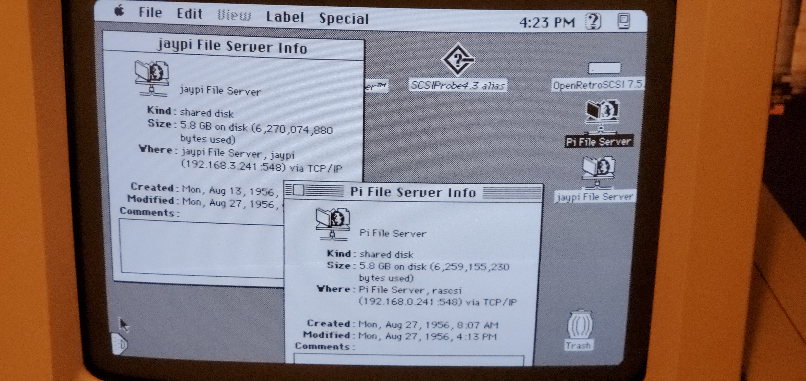

# Tailscale VPN
###

##  Install

After creating a [tailscale](https://www.tailscale.com) account, follow the [Raspberry Pi Bullseye
download instructions](https://tailscale.com/download/linux/rpi-bullseye)

Your pi now has a unique ip address that can be accessed by all devices in your private tailscale VPN.

This machine can also be accessed by its hostname through Tailscale's private DNS

##  Enable Subnets 

### Raspberry Pi

'Advertise routes' to provide access to the appleshare devices on this network and 'accept routes' to forward requests through the tailscale VPN to other remote devices

    sudo tailscale up --advertise-routes=192.168.0.0/24 --accept-routes

### Tailscale.com account

Select "Edit route settings" from the '3dots' menu on the right column and enable Subnet routes for this device

### Mac Appleshare
The above "enable subnet" sequence was also done for the second RaSCSI "jaypi" device at 192.168.3.241.  From the Chooser, go ahead and open this jaypi appleshare server

{:style="height:150px;width:300px"}

### Tailscale sharing option
You can even share this machine with other Tailscale customers.  There may be security concerns at exposing your network to others so be careful.

{:style="height:300px;width:300px"}
